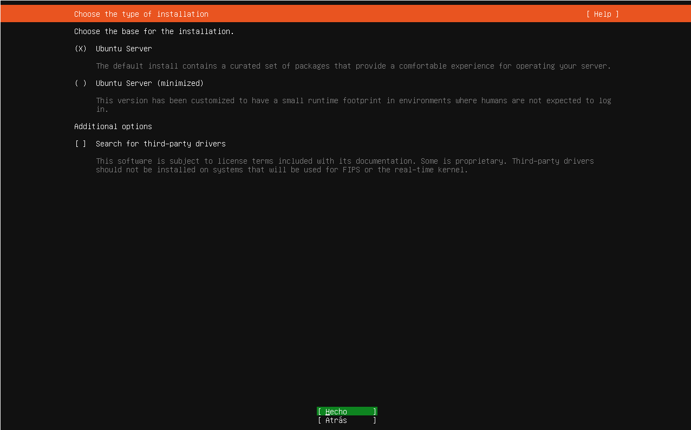
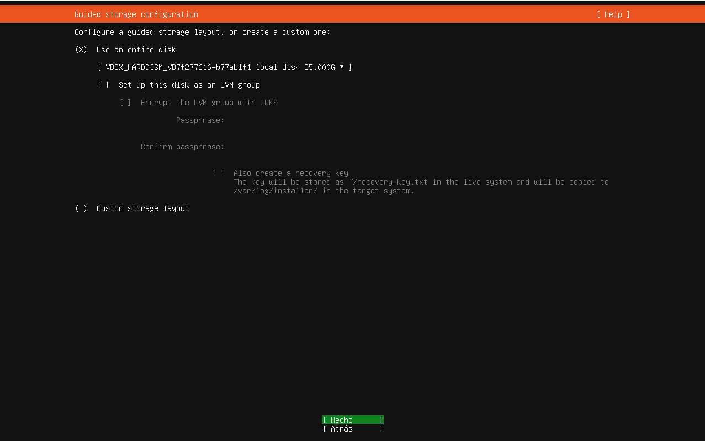
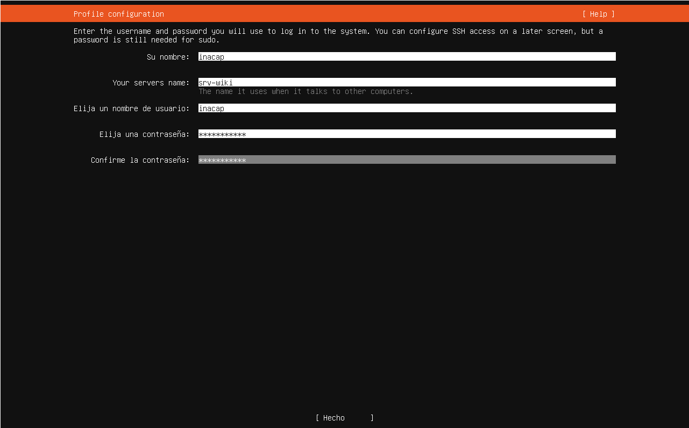
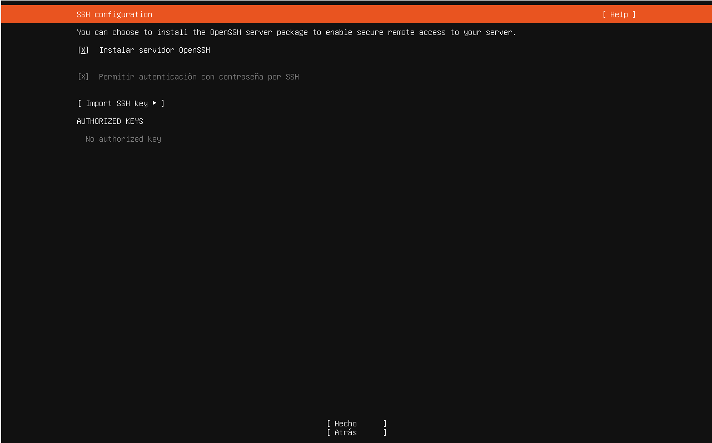
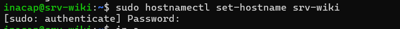
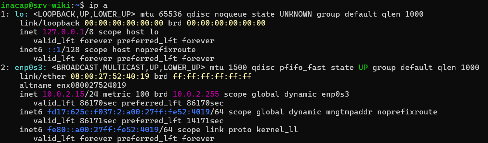
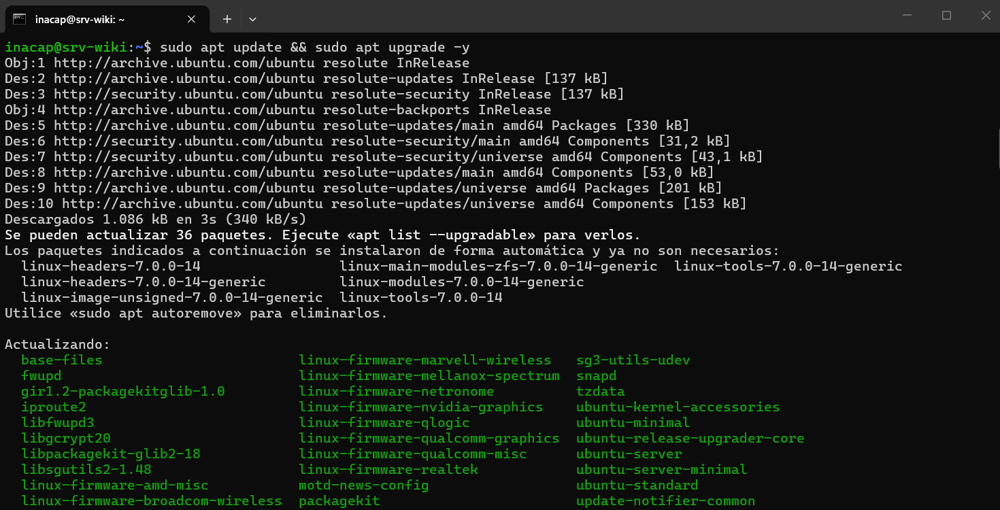
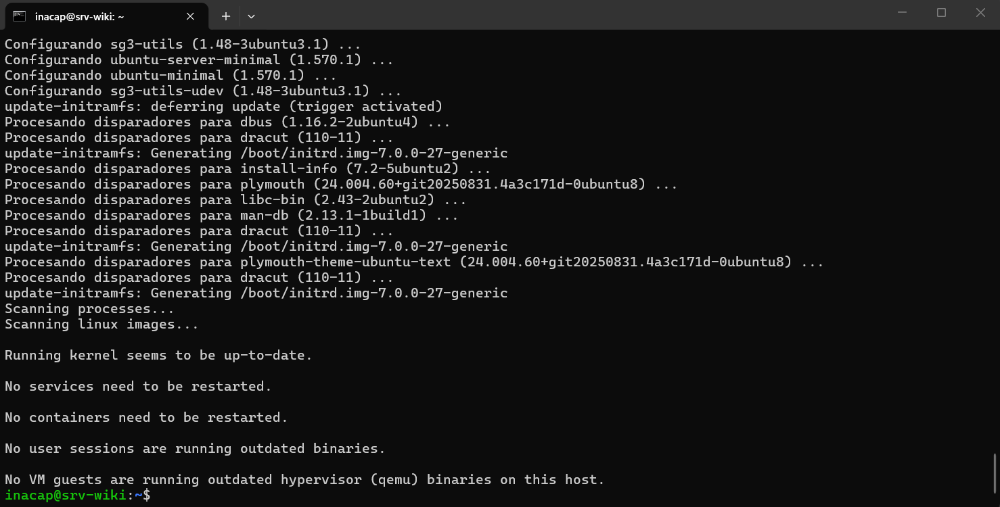
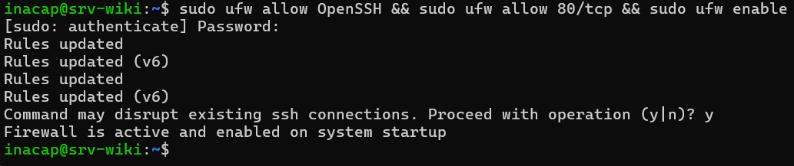
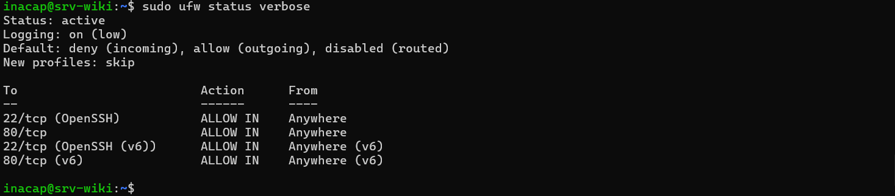

# Página 3: Instalación y Configuración Básica

## FASE 1: Preparación y Creación de la Máquina Virtual

### 1.1 Creación de la VM
- Primero, abrí VirtualBox y le di al botón de **Nueva** para crear la máquina.
- **Nombre:** Le puse de nombre `srv-wiki`.
- **Imagen ISO:** Busqué y cargué la ISO de Ubuntu Server 24.04 LTS que ya había descargado.
- **Tipo y Versión:** Me aseguré de que el tipo fuera **Linux** y la versión **Ubuntu (64-bit)**.
- *Nota:* Me salté la "instalación desatendida" porque quería hacer el proceso a mano y no perderme de nada.


### 1.2 Asignación de Recursos 
- **Memoria RAM:** Le asigné **4096 MB** (o sea, 4 GB).
- **Procesadores:** Le puse 2 CPUs para que anduviera fluido.
- **Disco Duro Virtual:** Le creé un disco duro nuevecito de **25 GB**.


---

## FASE 2: Configuración de Red y Reenvío de Puertos (Paso Clave)

Antes de prender la máquina, tuve que configurar la red para que mi pc de verdad se pudiera comunicar con el servidor Linux.

- Me metí a la **Configuración** de la máquina y fui a la pestaña de **Red**.
- **Adaptador 1:** Revisé que estuviera conectado a **NAT**.
- Abrí las opciones de **Avanzado** y entré a **Reenvío de puertos**.
- Acá agregué dos reglas importantes para redirigir el tráfico:
  1. **Regla SSH:** Nombre `ssh` | Protocolo `TCP` | Puerto de mi compu `2222` | Puerto del servidor `22`
  2. **Regla Web:** Nombre `web` | Protocolo `TCP` | Puerto de mi compu `8080` | Puerto del servidor `80`


---

## FASE 3: Instalación de Ubuntu Server

Ahora sí, prendí la máquina y arranqué con el instalador de Ubuntu. Estos fueron los pasos que seguí:


### 3.1 Tipo de instalación
- Dejé la opción que venía marcada por defecto: **`(X) Ubuntu Server`**. No quise usar la versión "minimizada" porque prefiero tener las herramientas estándar a mano. Le di a **[ Hecho ]**.




### 3.2 Configuración de Red
- Acá solo me fijé que la tarjeta de red (`enp0s3`) agarrara una IP sola por DHCP (me dio la `10.0.2.15`), lo que confirmaba que el NAT funcionaba bien. No toqué nada más y le di a **[ Hecho ]**.


### 3.3 Configuración de Proxy
- Como estoy en una red normal y no uso proxy, dejé ese espacio totalmente en blanco y pasé a la siguiente pantalla.


### 3.4 Configuración del Disco (Almacenamiento)
- Dejé marcado que usara todo el disco de 25 GB. 
- **Ojo acá:** Desmarqué la opción de usar **LVM** presionando la barra espaciadora. Lo hice para que fuera más simple y el sistema usara el 100% del disco de forma tradicional (ext4). Después confirmé la pantalla de resumen aceptando que se iba a formatear el disco virtual.



### 3.5 Creación de mi Usuario
Ingresé los datos tal cual los pedía la pauta del laboratorio:
- **Mi nombre:** `inacap`
- **Nombre del servidor:** `srv-wiki`
- **Nombre de usuario:** `inacap`
- **Contraseña:** Le puse una clave segura que me acordara fácilmente.



### 3.6 Ubuntu Pro
- Me preguntó si quería actualizar a Ubuntu Pro. Como esto es un lab de la u y no un servidor de empresa, le puse **`(X) Skip for now`** (omitir por ahora) y seguí.


### 3.7 Habilitar SSH (¡Súper importante!)
- Para poder conectarme más rato desde la terminal de mi compu, era obligatorio instalar SSH. Marqué la casilla **`[X] Install OpenSSH server`** apretando el espacio y le di a **[ Hecho ]**.



### 3.8 Programas Extra (Snaps)
- Como la guía pide que nosotros mismos instalemos Nginx y el resto de cosas a mano por línea de comandos, pasé de largo esta lista sin marcar absolutamente nada.


---
*(Acá dejé que el sistema instalara todo solo. Aprovechó de bajar unas actualizaciones de seguridad y, cuando terminó, le di a "Reboot Now" para reiniciar).*


---

## FASE 4: Mi primera conexión por SSH

Cuando la máquina se reinició y apareció la pantalla negra pidiendo el login, preferí no entrar por ahí, sino desde mi propio PC para poder copiar y pegar comandos más fácil.

1. Abrí la terminal en mi computador.
2. Escribí el siguiente comando para aprovechar el puerto 2222 que configuré al principio:
   ```bash
   ssh -p 2222 inacap@localhost


## FASE 5: Configuración del Hostname

Ya con la conexión establecida, ejecutamos los siguiente comando:


* **Comando ejecutado:** 
   ```bash
   sudo hostnamectl set-hostname srv-wiki

Para cambiar el nombre de mi equipo (hostname) a srv wiki. Se hizo uso de sudo  porque es necesario para poder realizar el cambio de configuración del sistema, pues se necesitan privilegios de administrador.



## FASE 6: Revisión de interfaces de Red

Luego se ejecuto el siguiente comando:

* **Comando ejecutado:**
   ```
   ip a

Esto para mostrar la configuración de todas las interfaces de red del equipo, incluyendo las direcciones ip que tiene asignadas.




## FASE 7: Actualización del Sistema

Después se ejecutó el siguiennte comando:

* **comando ejecutado:**
   ```
   sudo apt update && sudo apt upgrade -y

Este comando nos permitió ejecutar dos acciones secuenciales: Primero se actualiza la lista interna de paquetes disponibles(`update`), y, si tiene éxito, instala las versiones más recientes de los paquetes que ya se tienen instalados(`upgrade`). El parámetro `-y` sirve para responder automáticamente "sí" a cualquier mensaje de confirmación durante la instalación.



  


## FASE 8: Configuración del Firewall (UFW)

Se ejecutaron tres comandos concatenados para la configuración y activación del firewall:

* **comando ejecutado:**
   ```
   sudo ufw allow OpenSSH && sudo ufw allow 80/tcp && sudo ufw enable

Estos tres comandos Configuran y activa el cortafuegos (UFW - Uncomplicated Firewall). Primero permite el tráfico entrante para conexiones SSH, luego permite el tráfico web (puerto 80 protocolo TCP), y finalmente activa el cortafuegos. Como bien advierte tu guía, es vital permitir el SSH antes de activar el firewall para no bloquearte a ti mismo fuera del servidor.




Luego se ejecuto el siguiente comando: 

* **comando ejecutado:**
   ```
   sudo ufw status verbose


Esto con el fin de mostrar el estado actual del firewall de forma detallada, listando exactamente qué reglas (puertos/servicios) están permitidas o denegadas.




---


* **¿Qué es NAT? (Network Address Translation)**
Es un mecanismo que utilizan los routers para traducir las direcciones IP privadas de una red local (como las de tu casa o laboratorio) a una única dirección IP pública para poder salir a Internet. Gracias al NAT, múltiples dispositivos pueden compartir una sola conexión a Internet simultáneamente sin que haya conflictos de direcciones.

* **¿Para qué sirve el reenvío de puertos? (Port Forwarding)**
El reenvío de puertos le indica al router que, cuando reciba peticiones externas dirigidas a un puerto específico (por ejemplo, el puerto 80 para una página web o el 22 para SSH), debe redirigir ese tráfico hacia una dirección IP local específica dentro de tu red. Es fundamental si quieres montar un servidor (como tu wiki) y necesitas que sea accesible desde fuera de tu red local.

* **¿DHCP vs IP Fija?**

- **DHCP (Dynamic Host Configuration Protocol):** Es un protocolo que asigna direcciones IP de manera automática y temporal a los dispositivos. Es ideal para computadoras de escritorio, laptops y celulares, ya que facilita la conexión sin requerir configuración manual.

* **IP Fija (Estática):** Es una dirección IP que se configura manualmente en un dispositivo y nunca cambia. Es indispensable para servidores, impresoras de red o routers, ya que necesitas que estos equipos siempre se encuentren exactamente en la misma dirección para que los demás dispositivos (o el reenvío de puertos) puedan encontrarlos siempre de forma confiable.


