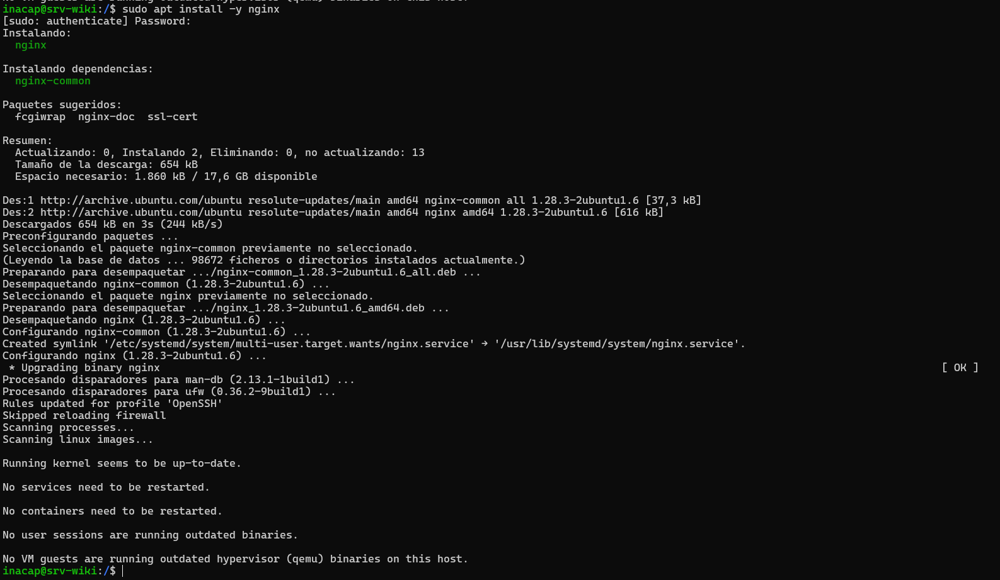
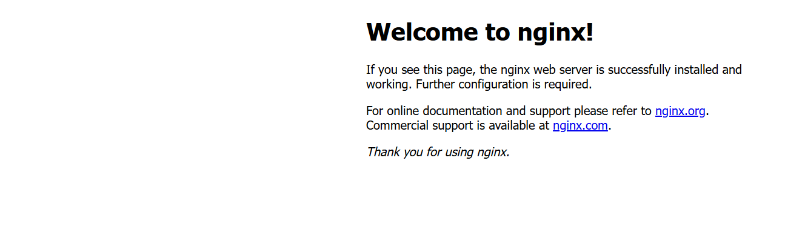
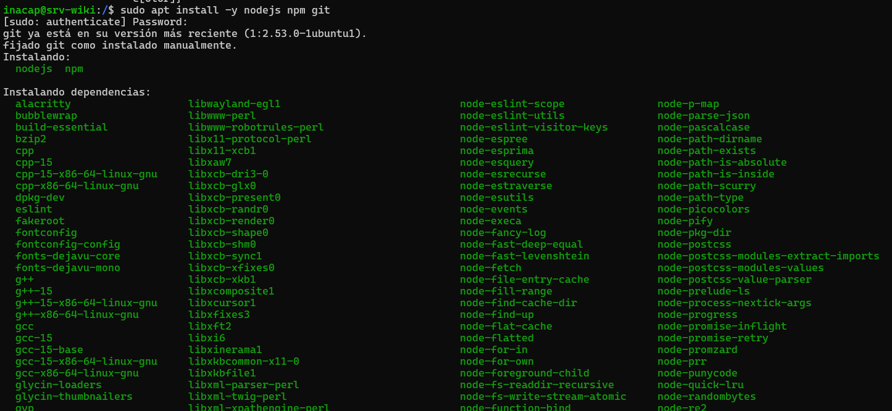
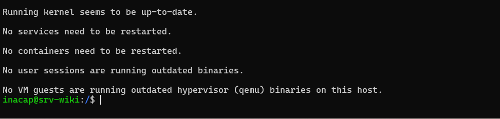
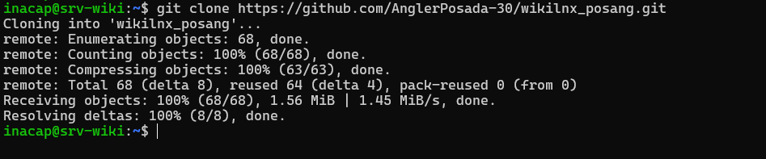
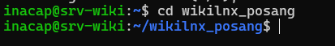

# Página 6: Despliegue de Servicios y Servidor Web (Nginx)

Llegamos a la etapa final y más importante del laboratorio. El objetivo aquí es transformar nuestra máquina virtual en un servidor web real, utilizando Nginx, para alojar y servir esta misma wiki hacia el exterior. 

A continuación, detallo el paso a paso de cómo construí y publiqué el sitio web operando únicamente desde la terminal.

## 1. Instalación del Servidor Web (Nginx)

* **A -> Instalación del Servidor Web (Nginx)**
El primer paso fue instalar el motor web que se encargará de servir nuestra aplicación. Opté por Nginx debido a que es ligero, rápido y actualmente uno de los estándares más utilizados en la industria para aplicaciones web estáticas, como la que estamos desplegando.

* **comando ejecutado:**
     ```bash
     sudo apt install -y nginx
     ```

Una vez completada la instalación, el servicio se inicia automáticamente. Con esto, el servidor queda habilitado para recibir peticiones HTTP a través del puerto 80, lo que significa que ya está funcionando como servidor web básico.

* **Mi Evidencia:**




* **B -> Verificación desde el Navegador**

Luego abrí el Navegador Web, Brave para ser específicos, y buscamos la URL:

[Link para abrir el servidor](http://localhost:8080)

Esto me permitió comprobar que el servidor estaba respondiendo correctamente y que la página por defecto de Nginx se encontraba disponible. En este punto, el servidor ya estaba conectado a la red y listo para recibir la estructura que posteriormente formará nuestra WIKI.



---

## 2. Preparación del Entorno y Construcción del Sitio

Como mi WIKI está desarrollada con React (Vite), Nginx no puede servir directamente el código fuente. Antes de publicarla, necesitaba generar la versión de producción: archivos HTML, CSS y JavaScript optimizados. Para eso preparé el entorno, descargué mi proyecto y ejecuté el proceso de construcción.

1. **Ejecutamos**:
     ```bash
     sudo apt install -y nodejs npm git
     ```
    
Este comando instala tres herramientas fundamentales:

- **nodejs**: el motor que permite ejecutar JavaScript fuera del navegador. Es indispensable para correr Vite y React.

- **npm**: el gestor de paquetes que instala todas las dependencias del proyecto.

- **git**: necesario para clonar mi repositorio desde GitHub.

*El parámetro -y acepta automáticamente todas las confirmaciones*






2. **Ejecutamos**:
     ```bash
     git clone <https://github.com/AnglerPosada-30/wikilnx_posang.git>

     ```

Con este comando descargué mi proyecto directamente desde `GitHub` hacia el servidor. Esto crea una carpeta con todo el código fuente de mi WIKI.



3. **Ejecutamos:**
     ```bash
     cd <mi-carpeta-del-proyecto>

     ```

Aquí simplemente ingresé a la carpeta recién descargada para poder trabajar dentro del proyecto.




El comando clave aquí es `npm run build`. Este proceso empaqueta todo mi código React y crea una carpeta llamada `dist/`. Esta carpeta contiene la web ya procesada y lista para ser publicada; esto es lo único que Nginx necesita.


4. **ejecutamos:**
     ```bash
     npm install
     ```

Este comando descarga e instala todas las dependencias necesarias para que el proyecto funcione: React, Vite, librerías adicionales, etc.
En otras palabras, reconstruye el entorno de desarrollo dentro del servidor.


---

## 3. Alojamiento y Permisos de los Archivos

Nginx necesita saber de dónde leer los archivos, y por convención, los sitios web en Linux se guardan en `/var/www/`.

* **comandos ejecutados:**
     ```bash
     sudo mkdir -p /var/www/wiki
     sudo cp -r dist/* /var/www/wiki/
     sudo chown -R www-data:www-data /var/www/wiki
     ```

**¿Por qué `chown www-data`?:** Este es un paso crítico de seguridad. `www-data` es el usuario de sistema que Nginx utiliza para ejecutarse. Al transferirle la propiedad de la carpeta `/var/www/wiki/`, le doy a Nginx el permiso exclusivo para leer y servir mis archivos hacia internet, evitando usar al usuario administrador para tareas web.

---

## 4. Configuración del Sitio (Virtual Host)

Luego, tuve que darle a Nginx las instrucciones exactas sobre cómo manejar mi sitio creando su archivo de configuración.

* **comando ejecutado:**
     ```bash
     sudo nano /etc/nginx/sites-available/wiki
     ```

Dentro de ese archivo, pegué la siguiente configuración:

```nginx
server {
    listen 80 default_server;
    root /var/www/wiki;
    index index.html;
    location / { try_files $uri $uri/ /index.html; }
}
```
Esta es la "receta" del sitio. Le dice a Nginx: "Escucha en el puerto 80, tu directorio raíz es `/var/www/wiki`, carga el archivo `index.html`, y si alguien busca una ruta que no existe físicamente, redirígelo al `index.html`" (esto último es vital para que las rutas de React funcionen correctamente sin dar error 404).

---

## 5. Activación y Recarga de Nginx

Para que la configuración anterior surtiera efecto, tuve que activarla creando un enlace simbólico, borrando el sitio por defecto que trae Nginx, probando la sintaxis y recargando el servicio.

* **comandos ejecutados:**
     ```bash
     sudo ln -s /etc/nginx/sites-available/wiki /etc/nginx/sites-enabled/
     sudo rm /etc/nginx/sites-enabled/default
     sudo nginx -t
     sudo systemctl reload nginx
     ```

El comando `nginx -t` es una excelente herramienta que prueba el archivo de configuración en busca de errores de tipeo (como un punto y coma faltante) antes de reiniciar el servicio, evitando que el servidor web se caiga por un error humano.

---

## 6. La Gran Prueba (Evidencia Clave)

Finalmente, abrí el navegador web en mi computadora anfitriona (fuera de la máquina virtual) e ingresé a `http://localhost:8080`. Gracias al reenvío de puertos (Port Forwarding) que configuré en VirtualBox, mi petición entró por el puerto 8080 de mi PC, viajó al puerto 80 del servidor Linux, y Nginx me respondió entregando la wiki perfectamente renderizada. 

Con esto, demostré la capacidad de desplegar un sitio web desde cero operando un servidor Linux por CLI.

> **Mi Evidencia:**
> ``